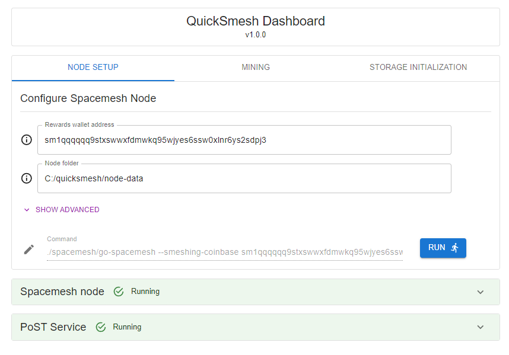

# QuickSmesh

**🏃‍♂️A quick and easy way to mine Spacemesh.**

QuickSmesh has been developed to simplify the process of Smeshing (mining for Spacemesh). Unlike other tools like [Smapp](https://github.com/spacemeshos/smapp) and [go-spacemesh](https://github.com/spacemeshos/go-spacemesh), QuickSmesh aims to provide a user-friendly interface with sensible defaults to make Smeshing a simple process.

Please try out QuickSmesh, [report](https://github.com/quicksmesh/QuickSmesh/issues) any issues you have, and contribute to the project to help make it even better!

## Quick Start

Simply download the [latest release](https://github.com/quicksmesh/QuickSmesh/releases/latest), unzip and launch the `quicksmesh` application.

## How do I use QuickSmesh?

QuickSmesh provides an easy to use UI which wraps the existing [go-spacemesh](https://github.com/spacemeshos/go-spacemesh) tool set. In order to start Smeshing you will need to run a Spacemesh node and a PoST miner. The two tabs within the interface easily allow to configure and run these two services.

Note that QuickSmesh is not a wallet app and cannot store your keys and identities, you will still need to use a separate Spacemesh wallet for this.

## Gotchas

QuickSmesh is still in its early stages, so there are a few things to keep in mind:

- Be very carful of [equivocation](https://docs.spacemesh.io/docs/start/smesher/equivocation)! Make sure you **never** run multiple nodes simultaneously which use the same PoST data, this will result in your PoST data's identity being permanently baned by the network. Soon QuickSmesh will warn you if this might happen.
- QuickSmesh currently does not support generating your own PoST data so at the moment you will need to point QuickSmesh to your pre-existing data. This feature is on our road map.
- You currently will have to manually copy across your PoST data's `identity.key` file into you Spacemesh node `identities` directory. In the future QuickSmesh will do this automatically.

## Roadmap

Make sure to stay tuned for new future updates!

Progress so far:

- [x] Configure and run Spacemesh nodes
- [x] Configure and run PoST service miners
- [x] View active process logs
- [ ] Automatically configure identity files
- [ ] Use profiler for proof generation settings
- [ ] Setup quick sync
- [ ] Generate PoST data
- [ ] Send GRPC queries and view node status
- [ ] 24 hour network support
- [ ] Dark mode
- [ ] Anything else you can think of!

## Contributing

If you would like to contribute please go ahead and create a new pull request!
